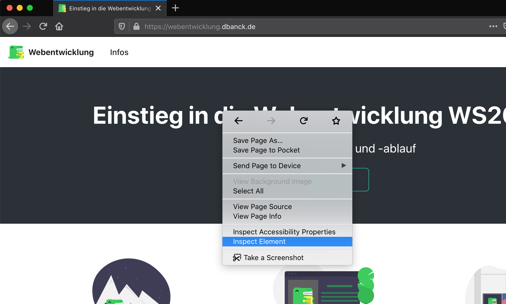
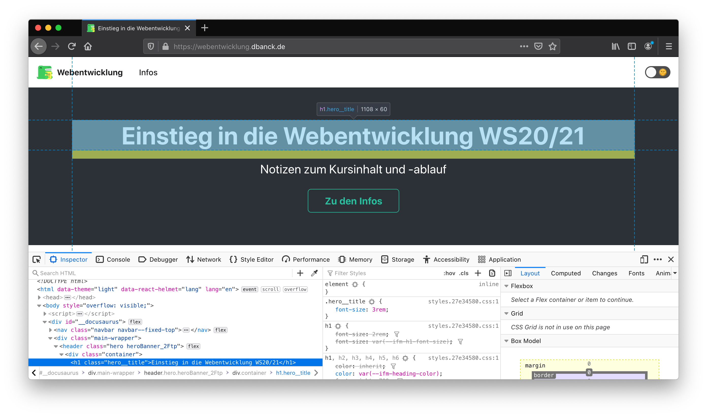
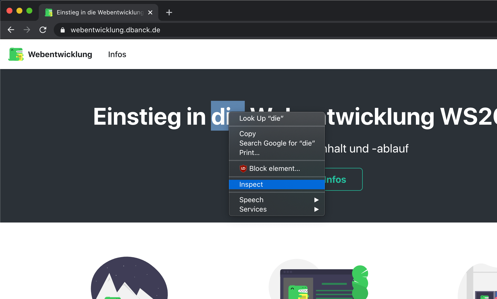
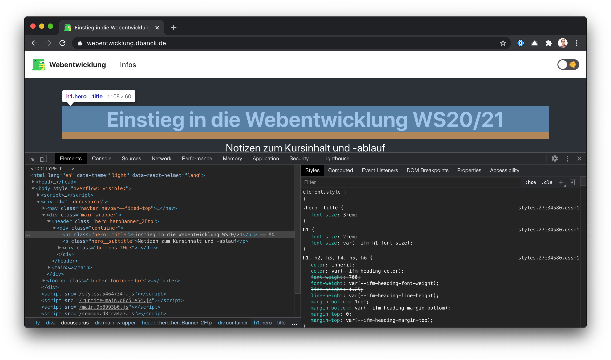
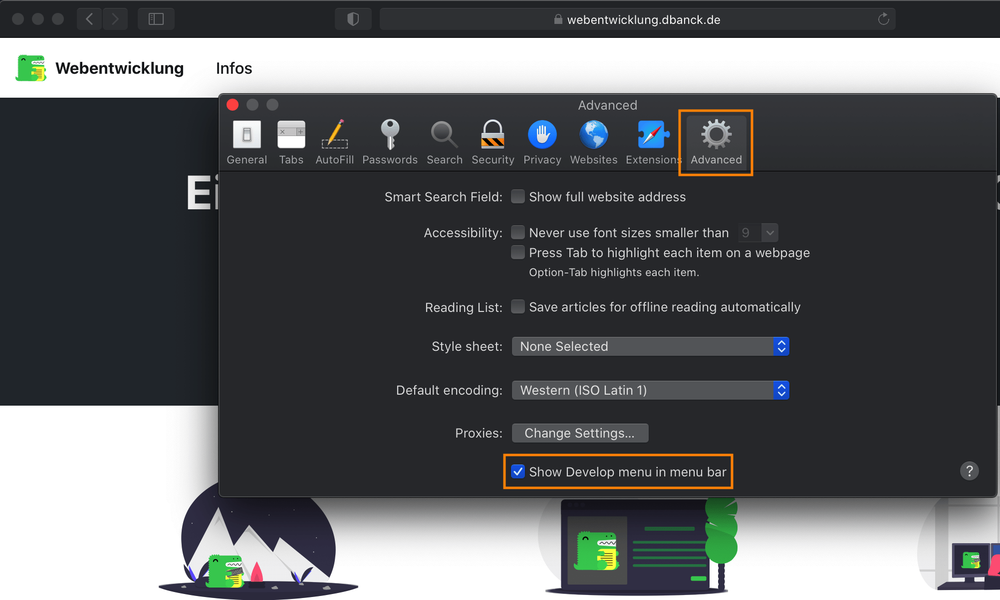
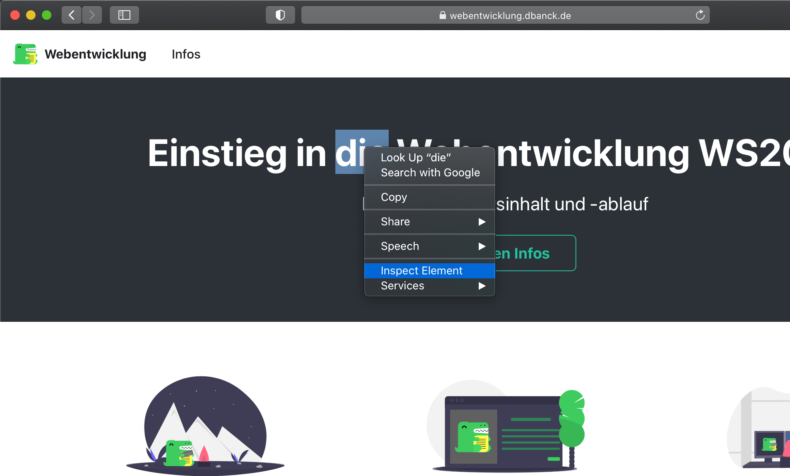
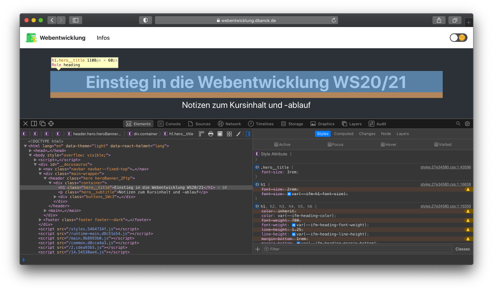

## Firefox

In Firefox kann mit einem Rechtsklick ein beliebiges Element untersucht werden...

...um die Entwicklertools zu öffnen.

## Google Chrome

Genauso kann in Google Chrome mit einem Rechtsklick ein beliebiges Element untersucht werden...

...um die Entwicklertools zu öffnen.

## Safari

Im Safari müssen die Entwicklertools zuerst in den Einstellungen eingeschaltet werden:

Danach kann ein Element untersucht werden...

...um die Entwicklertools zu öffnen.

