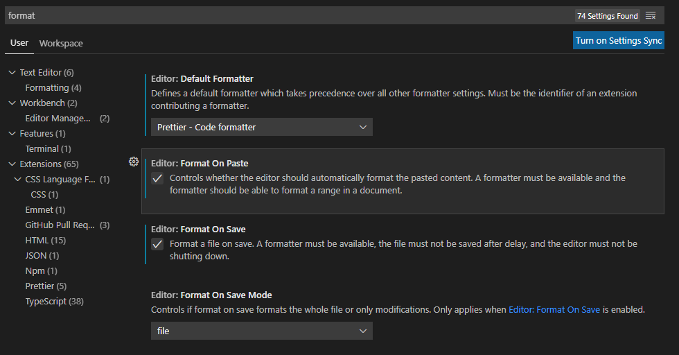

## VS Code

* [VS Code Online](https://vscode.dev/) - Editor direkt im Browser
* [VS Code](https://code.visualstudio.com/) - Perfekt für die lokale Entwicklung von Projekten
* Dazu könnten folgende Erweiterungen mit installiert werden:
  * [Prettier](https://marketplace.visualstudio.com/items?itemName=esbenp.prettier-vscode) - zur automatischen Formattierung von Code
  * [Live Server](https://marketplace.visualstudio.com/items?itemName=ritwickdey.LiveServer) - zum Starten einen Servers für eine einfacherer Entwicklung

Folgende Einstellungen sollten fuer Prettier vorgenommen werden:

## Weitere

* [Codesandbox](https://codesandbox.io/) – gut um komplexere Projekte online zu bauen
* [Codepen](https://codepen.io/) – für kleine Beispiele; mit großartiger Projektgallerie
* [SyncFiddle](https://syncfiddle.net/) – zum Zusammenarbeiten mit mehreren Personen
