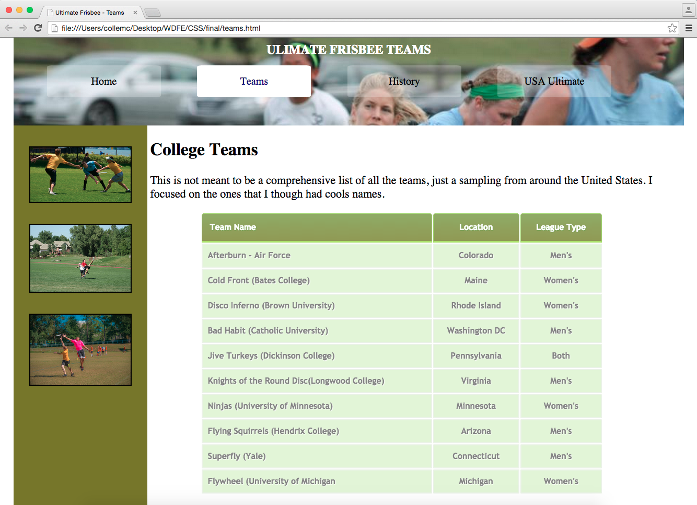

Um den Kurs mit Leistungspunkten vergütet zu bekommen, ist eine Prüfungsleistung erforderlich. Diese umfasst die Bearbeitung der Inhalte in Coursera, eine aktive Teilnahme am Kurs und eine finale Projektpräsentation. Das Projekt sollte in einer Gruppe aus 3 – 4 Personen bearbeitet werden.

Als Projekt soll eine Webseite gebaut werden, wobei Inhalt und Design komplett frei zu gestalten sind. Falls es in einer Gruppe keine konkrete Idee für eine Webseite gibt, hier ein paar Vorschläge:

- Bau einer Webseite für das eigene Portfolio oder einer befreundeten Firma
- Gestaltung einer Webseite für eine fiktive Bäckerei
- Nachbau einer existierenden Webseite als Übung

Das Ergebnis wird von jeder Gruppe am Ende des Kurses präsentiert. Der Quellcode sollte am besten öffentlich zugänglich, z.B. auf [Github](https://github.com/), zur Verfügung stehen.

:::info
Es ist empfehlenswert vor der der Weihnachtspause eine Gruppe und ein Projekt gefunden zu haben, sodass die ersten Abstimmungen und Arbeiten bereits starten können.
:::

Der Umfang eines Projektes sollte mindestens den im Coursera Kurs erarbeiteten Beispielen entsprechen. D.h. mehrere Seiten, eine Navigation, verschiedene Elemente pro Seite, Bilder, idealerweise auch mit einem stimmigen Design.

_Beispiel aus Coursera:_
